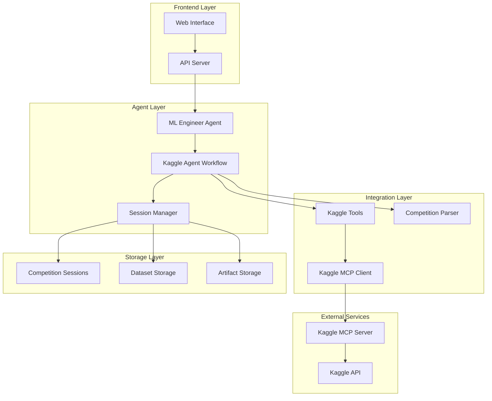

# Design Document

## Overview

The Kaggle Integration feature will extend the existing ML Engineer Agent to seamlessly discover, download, and participate in Kaggle competitions. This design leverages the existing Kaggle MCP server while adding new capabilities for competition-specific workflows, session management, and automated submission handling.

The integration will maintain compatibility with the current ML pipeline architecture while adding specialized tools and workflows for competitive machine learning scenarios.

## Architecture

### High-Level Architecture



### Component Integration

The design integrates with existing components:

- **ML Engineer Agent**: Extended with Kaggle-specific capabilities
- **Dataset Resolver**: Enhanced to handle competition datasets
- **Session Management**: Extended for competition-specific sessions
- **Python Executor**: Maintains existing functionality for competition solving
- **Artifact Storage**: Extended to store competition metadata and submissions

## Components and Interfaces

### 1. Kaggle Agent Workflow (KaggleAgentWorkflow)

**Purpose**: Orchestrates the complete Kaggle competition workflow from discovery to submission.

**Key Methods**:
```python
class KaggleAgentWorkflow:
    def search_competitions(self, query: str, status: str = "active") -> List[Competition]
    def get_competition_details(self, competition_id: str) -> CompetitionDetails
    def setup_competition_session(self, competition_id: str) -> CompetitionSession
    def download_competition_data(self, session: CompetitionSession) -> bool
    def solve_competition(self, session: CompetitionSession, prompt: str) -> SolutionResult
    def submit_solution(self, session: CompetitionSession, submission_path: str) -> SubmissionResult
```

**Integration Points**:
- Uses existing MLEngineerAgent for solution generation
- Leverages Kaggle MCP Server for API interactions
- Integrates with current session management system

### 2. Competition Session Manager (CompetitionSessionManager)

**Purpose**: Manages isolated environments for each competition with proper state tracking.

**Key Features**:
- Isolated directory structure per competition
- Metadata persistence and state tracking
- Session resumption capabilities
- Automatic cleanup and archiving

**Directory Structure**:
```
sessions/
├── {competition_id}_{timestamp}/
│   ├── metadata.json
│   ├── datasets/
│   │   ├── train.csv
│   │   ├── test.csv
│   │   └── sample_submission.csv
│   ├── notebooks/
│   │   └── solution.ipynb
│   ├── submissions/
│   │   ├── submission_001.csv
│   │   └── submission_002.csv
│   └── artifacts/
│       ├── models/
│       └── plots/
```

### 3. Competition Parser (CompetitionParser)

**Purpose**: Extracts and structures competition information for agent consumption.

**Key Capabilities**:
- Problem type detection (classification, regression, NLP, CV)
- Evaluation metric extraction
- Dataset schema analysis
- Submission format validation
- Deadline and rule parsing

**Output Format**:
```python
@dataclass
class CompetitionContext:
    id: str
    title: str
    description: str
    problem_type: ProblemType
    evaluation_metric: str
    submission_format: Dict[str, Any]
    deadline: datetime
    dataset_info: Dict[str, DatasetInfo]
    rules: List[str]
    sample_submission: Optional[pd.DataFrame]
```

### 4. Enhanced Kaggle Tools

**Purpose**: Extend existing tools with competition-specific functionality.

**New Tools**:
```python
@tool
def search_kaggle_competitions(query: str, status: str = "active") -> str:
    """Search for Kaggle competitions with filtering options"""

@tool  
def setup_kaggle_competition(competition_id: str) -> str:
    """Initialize a new competition session with all necessary data"""

@tool
def get_competition_context(competition_id: str) -> str:
    """Get structured competition information for agent planning"""

@tool
def validate_submission_format(file_path: str, competition_id: str) -> str:
    """Validate submission file against competition requirements"""

@tool
def submit_to_kaggle(competition_id: str, submission_path: str, message: str = "") -> str:
    """Submit solution to Kaggle competition"""
```

### 5. URL Parser and Competition Discovery

**Purpose**: Handle various input formats for competition identification.

**Supported Formats**:
- Full URLs: `https://www.kaggle.com/competitions/titanic`
- Short URLs: `https://www.kaggle.com/c/titanic`
- Competition IDs: `titanic`
- Search queries: `"machine learning classification"`

## Data Models

### Competition Session Model

```python
@dataclass
class CompetitionSession:
    id: str
    competition_id: str
    title: str
    created_at: datetime
    updated_at: datetime
    status: SessionStatus
    session_dir: Path
    metadata: CompetitionMetadata
    datasets: Dict[str, Path]
    submissions: List[SubmissionRecord]
    
@dataclass
class CompetitionMetadata:
    problem_type: ProblemType
    evaluation_metric: str
    deadline: datetime
    submission_format: Dict[str, Any]
    dataset_schema: Dict[str, Any]
    rules: List[str]

@dataclass
class SubmissionRecord:
    id: str
    file_path: Path
    submitted_at: datetime
    score: Optional[float]
    rank: Optional[int]
    message: str
    kaggle_submission_id: Optional[str]
```

### Enhanced Agent State

```python
class KaggleAgentState(AgentState):
    competition_session: Optional[CompetitionSession]
    competition_context: Optional[CompetitionContext]
    kaggle_mode: bool
    submission_ready: bool
```

## Error Handling

### Comprehensive Error Management

**API Error Handling**:
- Kaggle API authentication failures
- Rate limiting and quota management
- Network connectivity issues
- Competition access restrictions

**Data Error Handling**:
- Missing or corrupted competition files
- Invalid submission formats
- Dataset loading failures
- Insufficient disk space

**Workflow Error Handling**:
- Session state corruption
- Concurrent session conflicts
- Submission deadline violations
- Model training failures

**Error Recovery Strategies**:
- Automatic retry with exponential backoff
- Graceful degradation for non-critical failures
- Session state restoration
- User notification with actionable guidance

## Testing Strategy

### Unit Testing

**Component Tests**:
- Competition parser accuracy
- Session management operations
- URL parsing and validation
- Submission format validation
- Error handling scenarios

**Integration Tests**:
- Kaggle MCP server communication
- End-to-end competition workflow
- Session persistence and recovery
- Multi-competition session management

**Mock Testing**:
- Kaggle API responses
- File system operations
- Network failures
- Authentication scenarios

### Performance Testing

**Load Testing**:
- Multiple concurrent competition sessions
- Large dataset download handling
- Memory usage during model training
- Disk space management

**Stress Testing**:
- API rate limit handling
- Network interruption recovery
- Large file upload/download
- Session cleanup under load

### User Acceptance Testing

**Workflow Testing**:
- Complete competition participation flow
- Session switching and management
- Error recovery scenarios
- Submission validation and upload

**Usability Testing**:
- Competition discovery experience
- Progress tracking and feedback
- Error message clarity
- Documentation completeness

## Implementation Phases

### Phase 1: Core Integration (MVP)
- Extend MLEngineerAgent with Kaggle mode
- Implement basic competition session management
- Add competition discovery and setup tools
- Create competition context parser

### Phase 2: Enhanced Workflow
- Implement automated submission handling
- Add submission validation and formatting
- Create comprehensive error handling
- Implement session persistence and recovery

### Phase 3: Advanced Features
- Multi-competition session management
- Performance optimization and caching
- Advanced competition analytics
- Integration with existing notebook generation

### Phase 4: Production Readiness
- Comprehensive testing suite
- Documentation and examples
- Performance monitoring
- Security hardening

## Security Considerations

**API Security**:
- Secure Kaggle API credential storage
- Token refresh and rotation
- API rate limiting compliance
- Audit logging for API calls

**Data Security**:
- Secure handling of competition data
- Temporary file cleanup
- Session isolation
- Access control for sensitive data

**Submission Security**:
- Submission file validation
- Malware scanning for downloads
- Secure file transfer protocols
- Submission audit trails

## Performance Considerations

**Optimization Strategies**:
- Lazy loading of competition data
- Caching of frequently accessed metadata
- Parallel download of competition files
- Efficient session state management

**Resource Management**:
- Disk space monitoring and cleanup
- Memory usage optimization
- Network bandwidth management
- CPU usage balancing during training

**Scalability**:
- Support for multiple concurrent sessions
- Efficient session switching
- Background task processing
- Resource pooling and sharing